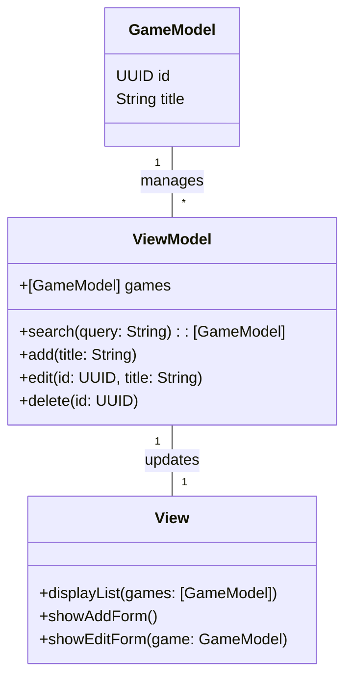
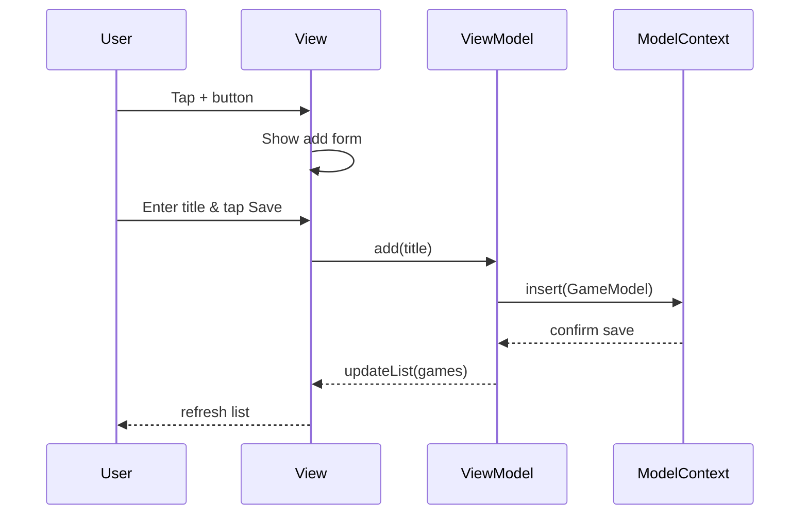

# autosave v1.0-MVP
First iteration of game catalogue with base functionality only.


## 1. Objective

Enable travelers to catalog their personal video game collection on the go, so they can quickly check whether they already own a title when browsing new or used video game stores.

## 2. Features

1. **List Games**: Display all cataloged games in a scrollable list.
2. **Search Games**: Provide a search bar to filter the list by title.
3. **Add Game**: Allow the user to enter a new game title and save it.
4. **Edit Game**: Allow the user to modify an existing game’s title.
5. **Delete Game**: Allow the user to remove a game from the catalog.

## 3. Acceptance Criteria

* **List Games**

  * All saved games appear in the list when the app launches.
* **Search Games**

  * Typing in the search bar filters the list in real time by title (case‑insensitive).
* **Add Game**

  * Cannot save a game if its title already exists (duplicate check).
  * Empty titles are disallowed.
* **Edit Game**

  * Cannot rename a game to a title that already exists elsewhere.
  * Changes persist immediately in the list.
* **Delete Game**

  * Confirm removal (optional) and update the list immediately.

## 4. User Stories

* **List**: As a traveler, I want to see all my games in a list, so I can know what I have at a glance.
* **Search**: As a traveler, I want to filter my list by typing a title, so I can find a specific game quickly.
* **Add**: As a traveler, I want to add a new title to my catalog, so I can track every game I own.
* **Edit**: As a traveler, I want to correct typos or rename titles, so my catalog stays accurate.
* **Delete**: As a traveler, I want to remove games I no longer own, so my catalog reflects reality.

## 5. Data Model Diagram

```
┌───────────┐
│   Game    │
├───────────┤
│ id: UUID  │  ← primary key, unique
│ title: String │  ← unique, nonempty
└───────────┘
```

## 6. UI Flow / Wireframe

1. **Home Screen**

   * Navigation bar with title “My Games”
   * Search bar at top
   * List of game titles below
   * “+” button to add a new game
2. **Add / Edit Screen**

   * Text field for title
   * Save button (disabled until nonempty & non‑duplicate)
   * Cancel button
3. **Delete**

   * Swipe left on a list row to reveal Delete
   * Confirm deletion (optional alert)

---

*This spec covers only the MVP scope. Platform and other property features are deferred to future iterations.*

## 7. Class Diagram (UML)



## 8. Sequence Diagram (Add Game)



```
```
